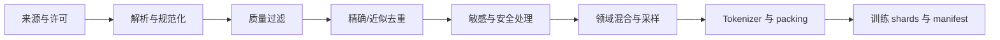

# M3.1 数据工程与预训练目标

  M3 · 数据、预训练与 SFT
  <strong>模型能力首先受训练分布和数据管线约束</strong>
  <button type="button" class="lesson-complete">标记为已完成</button>

## 1. 数据管线不是下载后直接拼接

每一步都必须输出统计：输入/保留文档数、token 数、语言/领域分布、删除原因、重复率和版本。否则无法解释模型变化来自算法还是数据。

## 2. Next-token prediction 的样本

长文档通常被切成固定长度 block，或将多个短文档 packing 到一个序列。需要明确：

- 文档边界是否插入 EOS；
- 短文档之间能否互相 attention；
- 末尾 token 如何 shift 成 labels；
- padding/跨文档位置是否计入 loss；
- 数据顺序、shuffle seed 和 shard 分配。

Packing 提高有效 token 比例，却可能改变跨文档上下文。高吞吐不自动等于正确数据语义。

## 3. 去重与污染

- **精确去重**：hash 规范化文本，删除完全重复；
- **近似去重**：MinHash/LSH、n-gram 相似度或 embedding 相似度；
- **benchmark contamination**：训练数据含测试题、答案或近似改写；
- **跨 split 泄漏**：同一文档家族出现在 train 与 validation/test。

污染检查必须在 tokenizer 前后都考虑，并记录匹配规则。仅搜索完整题面会漏掉模板化和局部重合。

## 4. 数据混合是一种隐式目标

设数据源 $i$ 有采样权重 $w_i$，训练分布为：

$$
p_{train}(x)=\sum_i w_i p_i(x).
$$

即使 loss 公式不变，改变 $w_i$ 也在改变模型优化目标。高质量小数据可能被温度采样上调；低资源语言可能需要独立权重。必须同时报告原始 token 占比和实际采样占比。

## 5. 数据审计的最低产出

| 证据 | 最低要求 |
|---|---|
| 数据卡 | 来源、许可、时间范围、语言/领域、限制 |
| Manifest | 文件 hash、样本数、token 数、处理版本 |
| 过滤统计 | 每条规则删除量与抽样人工复核 |
| 去重报告 | 方法、阈值、候选/删除比例、误删样本 |
| 污染报告 | benchmark、匹配粒度、命中和处置 |
| 训练样本快照 | tokenizer 后的真实序列、mask 和边界 |

## 本章验收

- [ ] 为一个公开小语料写出从来源到 shard 的数据卡。
- [ ] 对 1000 条样本做精确去重并人工检查删除项。
- [ ] 显示 packing 前后有效 token 比例和一个语义风险。
- [ ] 解释数据混合权重为什么是训练目标的一部分。
