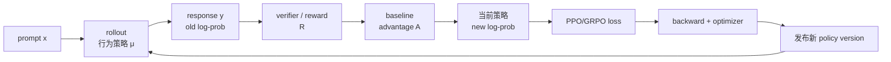
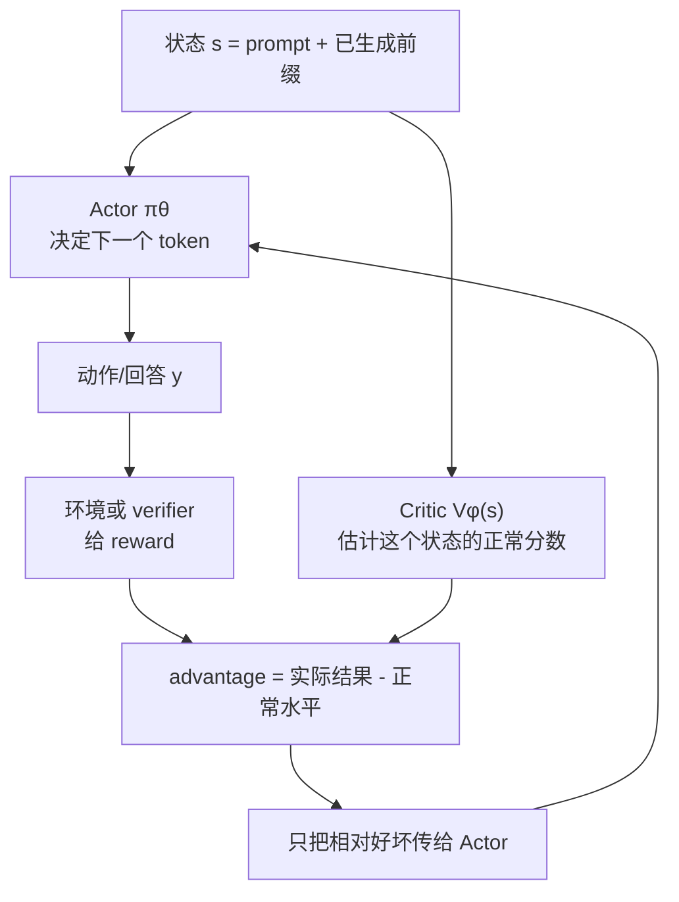

# M4.0 公式与项目读法

<div class="lesson-meta" data-lesson-id="m4-primer">
  <span>M4 · 先修</span>
  <strong>把公式、张量、日志和实验连成一条证据链</strong>
  <button type="button" class="lesson-complete">标记为已完成</button>
</div>

## 0.1 为什么你会看到一串公式

公式不是答案本身，而是把一句工程问题压缩成可计算的规则。例如，“新模型不要突然改变太多”可以写成“新旧概率的比值不要太大”；我们先理解这句话，再写比值。

本课程每次只引入当前问题需要的符号。看到一个公式时，按这个顺序读：

1. 先读等号左边：它是在定义概率、损失，还是梯度？
2. 再看右边每一项代表什么现实量。
3. 用一个很小的数字例子代入。
4. 最后才关心求导或极限。

## 0.2 本文的 LaTeX 约定

正文中的数学统一使用标准 Markdown 数学语法：行内公式写成 `$p=0.7$`，独立公式写成：

$$
p=\frac{\text{成功次数}}{\text{尝试次数}}.
$$

数学内容不会放在反引号里；反引号只用于代码、参数名和普通术语。若你的 Markdown 预览仍显示 `$...$` 原文，说明预览器没有 MathJax/KaTeX，不是公式本身坏了。可直接打开随文生成的 HTML 版本，或在编辑器中启用 MathJax/KaTeX 数学渲染。

## 0.3 一条 RL 样本的故事

先不看公式，把训练想成一条流水线：

```text
题目 prompt
  -> 模型生成答案（rollout）
  -> verifier / reward model 打分
  -> 把“比同组好多少”变成训练信号
  -> 当前模型重新计算答案的 log-prob
  -> 算 loss，反向传播，更新权重
  -> 把新权重发回生成服务
```

你后面看到的 PPO、GRPO、异步训练、KV cache，都是在回答这条流水线中的不同瓶颈。

把上面这条流水线画出来，是为了提醒你：奖励不是直接改参数，中间还要经过“优势、log-prob、loss、反向传播”几道转换。任何一道转换的分母或版本记错，最后都可能得到一个看似正常的 reward 曲线。



图中的回环就是 RL 与普通 SFT 的关键区别：模型先自己生成，再根据结果改变下一轮生成分布。后文每个 project 都会指出这条回环的一个工程瓶颈。

## 0.4 每章的固定 project 模板

每个 project 都有六个部分：

- **先看现象**：如果只看日志，你会发现什么问题？
- **最小模型**：只保留能解释现象的几个变量。
- **一步步推导**：每个公式后面立刻翻译成人话。
- **工程落点**：代码里保存什么、监控什么、哪里会出 bug。
- **动手实验**：用小模型或手算验证一个结论。
- **发散与追问**：把答案延伸到面试和真实系统。

不要把本课程当成需要一次背完的百科。每完成一个 project，就应该能回答“这个机制解决了什么、牺牲了什么、我怎样证明它在工作”。

## 0.5 公式、张量和日志其实是同一件事

初学时最容易卡住的地方，是纸上的符号与程序里的变量没有连起来。先看一条最小样本：

```text
prompt: "17 * 23 等于多少？"
response: "391"
reward: 1
old_logp: [-0.9, -0.2, -0.1]
new_logp: [-0.7, -0.15, -0.08]
mask: [1, 1, 1]
```

这几个对象在三种语言中的对应关系如下：

| 人话 | 数学 | 程序中常见的形状 |
|---|---|---|
| 一批题目 | $x_i$ | `input_ids: [batch, prompt_len]` |
| 第 $i$ 条完整回答 | $y_i=(y_{i,1},\ldots,y_{i,T})$ | `response_ids: [batch, seq_len]` |
| 这条回答得几分 | $R_i$ | `reward: [batch]` |
| 某个 token 比平均选择好多少 | $A_{i,t}$ | `advantage: [batch, seq_len]` |
| 新旧模型概率比 | $\rho_{i,t}$ | `ratio: [batch, seq_len]` |
| 哪些位置真的属于回答 | $m_{i,t}\in\{0,1\}$ | `response_mask: [batch, seq_len]` |
| 最后送进反向传播的一个数 | $L$ | `loss: []`，即标量 |

因此，看到

$$
\rho_{i,t}=\exp\!\left(\log p_{\mathrm{new},i,t}-\log p_{\mathrm{old},i,t}\right)
$$

时，不要先想求导。它在程序里首先只是：

```python
ratio = (new_logp - old_logp).exp()
```

如果旧概率是 $0.20$，新概率是 $0.30$，那么 $\rho=0.30/0.20=1.5$。人话是：“新模型把刚才那个 token 的概率提高了 50%。”只有理解这句话之后，才需要讨论 PPO 是否应该限制这次变化。

Actor--Critic 的关系也可以先用一张不带推导的图记住：



读图时先记一句话：Actor 负责“做选择”，Critic 负责“告诉它这次选择比平常好还是坏”。GRPO 只是把 Critic 的“正常水平”换成同一题的组内平均，并没有把 Actor 变成 Critic。

## 0.6 新手的三遍学习法

**第一遍只看故事。** 只读每章的“现象、数字例子、工程故障和验收”，先能回答它解决什么问题。公式允许暂时跳过。

**第二遍手算。** 把每章例子缩到两个动作、两条回答或两张 GPU，用计算器复现一个数字。此时目标不是背公式，而是发现哪个分母、符号或概率比改变了结论。

**第三遍看代码。** 对照伪代码打印中间张量：shape、均值、最大值、p99、是否含 NaN。能让纸上每个符号对应到一个张量，才算真正读懂。

建议先完成 Project 2（概率语言）、Project 5（advantage）、Project 7（PPO）、Project 9（多卡 loss）和 Project 25（利用率）。它们分别建立概率、训练信号、更新约束、分布式归约和系统观测五块地基；其余章节再按兴趣展开。


<!-- COURSE_BODY_MARKER -->

---

## 0.7 全书共用的最小符号系统

把一条提示词记作 $x$，模型生成的回答记作

$$
y=(y_1,y_2,\ldots,y_T).
$$

生成第 $t$ 个 token 前，状态和动作分别是

$$
s_t=(x,y_{<t}),\qquad a_t=y_t.
$$

当前待训练策略为 $\pi_\theta$，生成数据时真正使用的行为策略为 $\mu$，冻结的参考模型为 $\pi_{\mathrm{ref}}$。三者可能相同，也可能不同：

- $\pi_\theta$：现在要对它求梯度的模型；
- $\mu$：rollout 时实际采样的分布，包括 temperature、top-$k$、top-$p$ 等解码变换；
- $\pi_{\mathrm{ref}}$：通常由 SFT 模型冻结得到，用来限制策略不要漂移太远。

自回归分解是后面几乎所有推导的起点：

$$
\pi_\theta(y\mid x)
=\prod_{t=1}^{T}\pi_\theta(y_t\mid x,y_{<t}),
$$

所以

$$
\log \pi_\theta(y\mid x)
=\sum_{t=1}^{T}\log \pi_\theta(y_t\mid x,y_{<t}).
$$

回答得到的终局奖励记作 $R(x,y)$。一般强化学习还会有逐步奖励 $r_t$、折扣因子 $\gamma\in[0,1]$、回报 $G_t$：

$$
G_t=\sum_{k=t}^{T}\gamma^{k-t}r_k.
$$

如果只有回答结束时给一个奖励，并取 $\gamma=1$，那么每个生成位置的 Monte Carlo 回报都是同一个终局奖励 $R(x,y)$。

---
