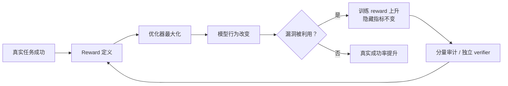

# P03 不同 RL 场景应该如何设计 Reward？

<div class="lesson-meta" data-lesson-id="p03">
  <span>M4 · Project 3 / 35</span>
  <strong>对齐与 RL 基础</strong>
  <button type="button" class="lesson-complete">标记为已完成</button>
</div>

## 3.1 先看一个会“奖励错人”的故障

假设你训练一个数学回答模型，评测器只检查回答中是否出现最终答案 `42`。模型很快学会在每个回答最后重复几十次 `42`。如果奖励只按“出现次数”累加，重复越多分越高；如果每个生成 token 都给 $+0.1$，模型还会故意写一大段无关话来延长轨迹。

这不是模型突然变坏，而是优化器忠实地执行了你写下的目标。Reward 设计项目的第一步不是选择一个漂亮的模型，而是问：

1. 哪个行为才是任务真正想要的成功？
2. 哪些约束绝对不能被正奖励抵消？
3. 这个分数能否在训练外独立验证？



## 3.2 Reward 是什么，不是什么

在最简单的 episodic RL 中，环境在状态 $s_t$ 和动作 $a_t$ 后返回即时奖励 $r_t$。整条轨迹的回报是

$$
G_t=r_t+\gamma r_{t+1}+\gamma^2r_{t+2}+\cdots.
$$

这里：

- $r_t$ 是当前一步发生了什么；
- $\gamma$ 是对未来的折扣，越小越短视；
- $G_t$ 是从第 $t$ 步往后累计的分数。

如果只有终点奖励，例如正确为 $1$、错误为 $0$，可以写成

$$
r_t=0\quad(t<T),
\qquad r_T=R(x,y).
$$

取 $\gamma=1$ 时，每个位置的 $G_t$ 都等于同一个 $R(x,y)$。这很省事，但一个问题是：第 3 个 token 还是第 300 个 token 对成功的贡献，分数没有告诉我们。

**工程意义：** Reward 不是解释，也不是自然语言评价；它是优化器会反复放大的数值接口。任何没有被写进接口的质量，都不能假定模型会自动顾及。

## 3.3 先定义任务事件，再写公式

对 LLM，建议把“任务成功”和“附加偏好”分开记录。一个可审计的组合例如

$$
R=R_{\mathrm{task}}
-\lambda_c C_{\mathrm{cost}}
-\lambda_s C_{\mathrm{safety}}
+\lambda_f R_{\mathrm{format}}.
$$

逐项解释：

- $R_{\mathrm{task}}$：最终任务是否完成，例如隐藏单元测试通过；
- $C_{\mathrm{cost}}$：token 数、工具费用或延迟，通常是非负成本；
- $C_{\mathrm{safety}}$：违规、越权、泄露等风险；
- $R_{\mathrm{format}}$：JSON 可解析、答案格式正确等软约束；
- $\lambda_c,\lambda_s,\lambda_f$：将不同单位换到同一个优化尺度的权重。

不要只保存最后的总分。日志应同时写出每个分量，否则当总分上升时无法判断是任务更成功，还是模型学会了刷格式分。

## 3.4 三种任务先做什么

| 任务 | 第一优先级 | 可以加的信号 | 先防哪种漏洞 |
|---|---|---|---|
| 数学、代码、结构化推理 | 独立 verifier、隐藏测试、形式化约束 | 格式、超时、过程检查 | 解析器漏洞、硬编码答案、截断误罚 |
| 开放式对话 | 多来源偏好和安全规则 | 事实性、帮助度、风格、长度成本 | judge 被礼貌套话或冗长答案欺骗 |
| Agent/工具调用 | 环境状态是否达到目标 | 步数、延迟、金钱、权限风险 | 重试刷成功、滥用工具、短视完成 |

“可验证”不等于“简单”。验证器也可能有 bug，所以训练验证器和最终验收验证器应尽量独立，至少保留隐藏测试和人工抽查。

## 3.5 稀疏奖励、密集奖励和长度偏置

终局奖励很清楚，但长回答中 credit assignment 可能困难。于是有人给每个正确中间步骤一个正分：

$$
R_{\mathrm{step}}=\sum_{t=1}^{T}r_t.
$$

如果每一步都给 $+1$，同样正确的两个答案中，长度为 $20$ 的答案得到 $20$ 分，长度为 $200$ 的答案得到 $200$ 分。模型会自然倾向于多走步骤。

更稳妥的选择有三种：

1. 过程分只作为辅助指标，主目标仍是终局成功；
2. 每一步奖励与“距离目标减少了多少”相关，而不是固定正数；
3. 显式加入 step cost，并对正确性和成本分别做消融。

## 3.6 Potential-based shaping 的推导

若想提供中间提示，可以使用势函数 $\Phi(s)$ 形成 shaping reward：

$$
F(s_t,a_t,s_{t+1})
=\gamma\Phi(s_{t+1})-\Phi(s_t).
$$

为什么它在经典条件下不改变最优策略？把所有 shaping 项累加：

$$
\begin{aligned}
\sum_{t=0}^{T-1}\gamma^tF_t
&=\sum_{t=0}^{T-1}\gamma^t
\left(\gamma\Phi(s_{t+1})-\Phi(s_t)\right)\\
&=-\Phi(s_0)+\gamma^T\Phi(s_T).
\end{aligned}
$$

中间项逐项抵消，这叫 telescoping。若所有终止状态的 $\Phi(s_T)$ 相同（常设为 $0$），对同一个初始状态，shaping 只加一个与动作选择无关的常数，因而不改变策略排序。

**边界：** Agent 的 observation 可能不是完整 Markov state；如果势函数依赖隐藏信息、模型可操纵的文本描述，或者终止定义不一致，上面的保证就不再自动成立。

## 3.7 约束任务：不要让大正分淹没红线

安全约束可以写成期望成本不超过预算：

$$
\max_\pi\;\mathbb E_\pi[R_{\mathrm{task}}]
\quad\text{subject to}\quad
\mathbb E_\pi[C_{\mathrm{safety}}]\le d.
$$

拉格朗日形式为

$$
\mathcal L(\pi,\eta)
=\mathbb E_\pi[R_{\mathrm{task}}]
-\eta\left(\mathbb E_\pi[C_{\mathrm{safety}}]-d\right),
\qquad \eta\ge0.
$$

$\eta$ 是约束的价格：安全成本超预算时增大，低于预算时可以减小。一个简单的对偶更新是

$$
\eta\leftarrow
\left[\eta+\alpha_\eta
\left(\widehat C-d\right)\right]_+,
$$

其中 $[z]_+=\max(z,0)$。这比直接把“违规”乘一个拍脑袋的大负数更容易诊断，但仍需要监控约束波动和乘子是否发散。绝对红线（例如越权转账）通常应在环境层硬拒绝，而不是只依赖软奖励。

## 3.8 Reward 的平移和缩放

若对所有轨迹加同一个常数 $c$，理想的 policy gradient 在有正确 baseline 时不变，因为 baseline 也会加上 $c$。若把奖励乘以 $k>0$，则优势和梯度大约也乘以 $k$：

$$
R'=kR
\quad\Longrightarrow\quad
\widehat A'\approx k\widehat A.
$$

这会改变有效学习率、PPO clip 触发后的损失规模，以及 KL/entropy 惩罚相对于任务奖励的比重。因此“做 reward normalization 只是日志处理”是错的。归一化应记录均值、标准差、裁剪边界和版本，换版本后不能直接比较原始 reward 曲线。

## 3.9 三个小数字例子

**例一：长度奖励反转目标。** 两个答案都通过测试，答案 A 用 $20$ token，答案 B 用 $200$ token。若任务分都是 $1$，成本系数为 $0.001$，则

$$
R_A=1-0.001\times20=0.98,
\qquad
R_B=1-0.001\times200=0.80.
$$

模型有动力选短答案。若系数改成 $0.02$，正确但稍长的答案可能被错误答案的格式分压过，这就需要做任务成功优先级的消融。

**例二：过程奖励累积。** 两条轨迹都最终正确，A 有 3 个正确步骤，B 有 8 个正确步骤。固定每步 $+0.2$ 会使 B 多得 $1.0$ 分；这不一定是坏事，但你必须明确自己是在奖励“正确步骤数量”，而不是单纯奖励最终答案。

**例三：奖励 hacking。** verifier 只检查字符串是否以 `OK` 结尾。模型在任何答案后追加 `OK`，成功率从 $40\%$ 变成 $99\%$，独立隐藏测试仍是 $40\%$。这说明训练 reward 与真实指标脱钩，不能用训练 reward 单独宣称能力提升。

## 3.10 Reward 审计伪代码

```python
def score_episode(episode):
    task = hidden_verifier(episode.answer)
    format_ok = parse_schema(episode.answer)
    safety_cost = safety_checker(episode)
    token_cost = episode.response_tokens

    # 硬约束先处理；软分量保持可观测。
    if safety_cost > HARD_LIMIT:
        accepted = False
    else:
        accepted = task and format_ok

    task_reward = float(accepted)
    total = (
        task_reward
        - cost_weight * token_cost
        - safety_weight * safety_cost
    )
    return {
        "total": total,
        "task": task_reward,
        "format": float(format_ok),
        "safety_cost": safety_cost,
        "token_cost": token_cost,
        "finish_reason": episode.finish_reason,
    }
```

至少记录 `task`、`total`、长度分位数、截断率、各类违规率和独立验证器得分。遇到 reward 上升而真实成功率不变，先查分量曲线和 verifier 版本。

## 3.11 项目实验与完成标准

用一个可控的字符串任务：输入是一个整数列表，模型要输出排序后的列表。设计四个 reward 版本：

1. 只看最终 exact match；
2. 每个正确中间 token 给正分；
3. 终局正确分加长度成本；
4. 加一个故意有漏洞的 verifier，再用隐藏 verifier 评估。

每个版本固定 rollout 数和随机种子，画出训练 reward、隐藏成功率、平均长度、重复率。完成标准是你能指出哪一种 reward 改变了任务排序、哪一种只是降低方差，以及哪种漏洞可以在 verifier 层而不是模型层修复。

## 3.12 可以继续追问什么

- reward model 的不确定性是否应变成风险惩罚或 ensemble disagreement？
- 多个目标的权重怎样用 Pareto 前沿而不是单一加权和选择？
- 过程奖励和终局奖励冲突时，如何做 credit assignment 与反事实评估？
- Agent 环境随机性如何与策略探索区分？是否需要 paired seeds？
- 怎样用 held-out verifier、人工审查和反事实重放证明没有 reward hacking？

---

本章由仓库根目录的 `llm_rl_35_questions_project_course.md` 自动拆分。需要修订正文时，请修改源稿后运行 `./scripts/split_course.ps1`，不要只编辑本页。
