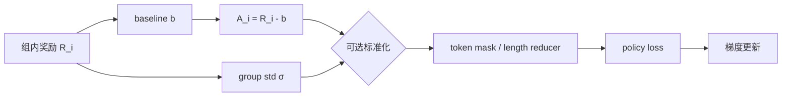

# P05 Advantage 怎么算？为什么减 baseline？一定要除以标准差吗？

<div class="lesson-meta" data-lesson-id="p05">
  <span>M4 · Project 5 / 35</span>
  <strong>对齐与 RL 基础</strong>
  <button type="button" class="lesson-complete">标记为已完成</button>
</div>

## 5.1 先看一个“所有 token 都收到同样惩罚”的问题

某条回答最后得分 $0$，长度是 $200$；另一条回答最后得分 $1$，长度是 $20$。如果直接把终局分数广播到每个 token，第一条的 $200$ 个 token 都拿到 $0$，第二条的 $20$ 个 token 都拿到 $1$。模型知道哪条回答整体更好，却不知道是哪个局部决定了成败。另一方面，不同题目的 reward 尺度不同，会让简单题的梯度远大于难题。

Advantage 项目要回答四个具体问题：

1. $Q$、$V$、$A$ 分别在估计什么；
2. baseline 为什么能降方差而不改变理想期望；
3. GAE 如何把一步 TD 和 Monte Carlo 连起来；
4. GRPO 的组均值、leave-one-out 和标准差归一化会引入什么统计效应。

## 5.2 三个价值量的直觉

假设从状态 $s$ 开始，模型先选动作 $a$，随后继续生成。定义：

$$
V^\pi(s)=\mathbb E_\pi[G_t\mid s_t=s],
$$

它是“站在这个前缀上，按当前策略继续写，平均能得多少分”。

$$
Q^\pi(s,a)=\mathbb E_\pi[G_t\mid s_t=s,a_t=a],
$$

它是“强制这一步选 $a$ 后，未来平均多少分”。

$$
A^\pi(s,a)=Q^\pi(s,a)-V^\pi(s).
$$

优势只看相对差异：如果某个前缀本来就很容易得到 $0.9$ 分，一个得到 $0.91$ 的动作优势只有 $0.01$；如果前缀很难，得到 $0.3$ 也可能是正优势。

## 5.3 为什么 baseline 不改变期望梯度

从 policy gradient 出发：

$$
g=\mathbb E\left[G_t\nabla_\theta\log\pi_\theta(a_t\mid s_t)\right].
$$

用只依赖 $s_t$ 的 $b(s_t)$ 替换回报：

$$
g_b=\mathbb E\left[(G_t-b(s_t))
\nabla_\theta\log\pi_\theta(a_t\mid s_t)\right].
$$

差值是

$$
g-g_b
=\mathbb E\left[b(s_t)\nabla_\theta\log\pi_\theta(a_t\mid s_t)\right].
$$

固定状态后，对所有动作求和：

$$
\sum_a\pi_\theta(a\mid s)\nabla_\theta\log\pi_\theta(a\mid s)
=\sum_a\nabla_\theta\pi_\theta(a\mid s)
=\nabla_\theta1=0.
$$

所以 $g_b=g$。这个证明有一个重要前提：$b$ 不能依赖当前动作 $a_t$，而且在反向传播时应当停止梯度。把当前 reward 本身放进 baseline 会让优势趋近零，不是更好的降方差。

## 5.4 最优 baseline 的直觉

不同动作的 score 向量

$$
z(a)=\nabla_\theta\log\pi_\theta(a\mid s)
$$

大小可能不同。对标量 baseline $b$，单个样本梯度是 $(G-b)z$。在只考虑该状态的条件下，最小化它的平方范数期望：

$$
b^*(s)=
\frac{\mathbb E[G_t\|z(a_t)\|^2\mid s_t=s]}
{\mathbb E[\|z(a_t)\|^2\mid s_t=s]}.
$$

若各动作的 score 范数差异不大，$b^*(s)$ 近似 $\mathbb E[G_t\mid s]=V(s)$。所以 value function 是便宜、通常有效的 baseline，但严格的方差最优 baseline还可能考虑 score 的大小。

## 5.5 TD、Monte Carlo 和 GAE

如果只有终局奖励，可以直接用

$$
\widehat A_t^{\mathrm{MC}}=G_t-V_\phi(s_t).
$$

它使用完整结果，偏差较小，但 reward 长尾会带来高方差。一步 TD 只看相邻状态：

$$
\delta_t=r_t+\gamma V_\phi(s_{t+1})-V_\phi(s_t).
$$

它计算便宜、方差低，但依赖 Critic 的准确性。将多个 TD 残差按衰减权重相加：

$$
\widehat A_t^{\mathrm{GAE}}
=\delta_t+(\gamma\lambda)\delta_{t+1}
+(\gamma\lambda)^2\delta_{t+2}+\cdots.
$$

每一项的含义是：当前误差、下一步误差、再下一步误差；$\gamma$ 表示任务折扣，$\lambda$ 表示愿意相信多远的 bootstrap。$\lambda=0$ 只有当前 TD，$\lambda=1$ 接近完整回报差值。

## 5.6 GRPO 组内 baseline 的手算

同一个 prompt 采样 $G=4$ 条回答，奖励为

$$
(1,1,0,0).
$$

组均值是

$$
\overline R=\frac{1+1+0+0}{4}=0.5.
$$

含自身的中心化优势为

$$
(0.5,0.5,-0.5,-0.5).
$$

它告诉模型成功样本相对本组平均更好，失败样本更差。若四条奖励全是 $1$，则四个优势全为 $0$，这一组不更新；这解释了为什么动态采样常丢弃“没有区分度”的 group。



## 5.7 含自身均值为什么有缩放偏差

很多人直接套用“baseline 不依赖动作所以无偏”的证明，但组均值包含当前样本：

$$
\overline R=\frac1G\sum_{j=1}^{G}R_j.
$$

固定 prompt，令 $g_i=\nabla\log\pi(y_i\mid x)$，样本独立。组估计量是

$$
\widehat g
=\frac1G\sum_{i=1}^{G}(R_i-\overline R)g_i.
$$

展开第 $i$ 项的自相关部分：

$$
\mathbb E[\overline R g_i]
=\frac1G\mathbb E[R_i g_i]
+\frac1G\sum_{j\ne i}\mathbb E[R_j]\mathbb E[g_i].
$$

因为 $\mathbb E[g_i]=0$，只剩第一项，所以

$$
\mathbb E[\widehat g]
=\frac{G-1}{G}\mathbb E[Rg].
$$

例如 $G=4$ 时，期望梯度是原始梯度的 $3/4$。这不一定令训练失败，学习率可以吸收一个常数，但它说明不能把含自身均值严格称作 action-independent baseline。

## 5.8 Leave-one-out baseline

排除当前回答后，baseline 为

$$
b_{-i}=\frac1{G-1}\sum_{j\ne i}R_j,
\qquad
A_i^{\mathrm{LOO}}=R_i-b_{-i}.
$$

由于 $b_{-i}$ 与 $y_i$ 独立，前面的无偏证明可以直接使用。$G=4$、奖励 $(1,1,0,0)$ 时：

- 对第一个成功样本，$b_{-1}=1/3$，优势为 $2/3$；
- 对第三个失败样本，$b_{-3}=2/3$，优势为 $-2/3$。

LOO 的数值不再是对称的 $\pm0.5$，但避免了自身 reward 同时作为参照的相关性。实际算法可能采用含自身 mean、LOO、RLOO 或其他变体，阅读代码时要逐项核对。

## 5.9 为什么有人除以 group standard deviation

常见归一化为

$$
\widetilde A_i
=\frac{R_i-\overline R}{\sigma_R+\varepsilon}.
$$

其中 $\sigma_R$ 是组内标准差，$\varepsilon$ 防止除零。它的工程直觉是让难题组和简单题组的梯度尺度更接近。

但它不是 policy gradient 正确性的必需条件：

1. $\sigma_R$ 很小时，微小 verifier 噪声会被放大；
2. 每个 prompt 都被缩到类似方差，可能过度放大本来不可靠的困难组；
3. 分母由同批 reward 计算，和 numerator 相关，不能套用固定 baseline 的无偏证明；
4. reward 的尺度、token 聚合和 learning rate 会一起变化。

二值奖励例子：$G=8$，只有一条成功。population standard deviation 为

$$
\sigma=\sqrt{\frac18\left(\left(1-\frac18\right)^2
+7\left(0-\frac18\right)^2\right)}
=\frac{\sqrt7}{8}.
$$

成功样本的归一优势约为 $\sqrt7$，每个失败样本约为 $-1/\sqrt7$。单个成功因此获得很大的正权重；这可能促进探索，也可能过度相信一次偶然通过。

## 5.10 Dr.GRPO 类修正到底在改什么

不同实现常有两个额外因素：每条回答损失前乘 $1/T_i$，以及用 group standard deviation 归一优势。它们会使短回答和低方差 group 的总权重与长回答、高方差 group 不同。所谓“去掉长度/标准差归一”不是一句普适规则，而是一个改变样本权重的目标设计；去掉后必须重新校准 batch token 数、学习率和梯度裁剪。

最安全的审计方法是把每条 response 的最终系数写出来：

$$
w_{i,t}=\underbrace{A_i}_{\text{reward 权重}}
\times\underbrace{c_i}_{\text{长度/组归一}}
\times\underbrace{d_{i,t}}_{\text{token mask 与 ratio}}.
$$

只要 $c_i$ 或 $d_{i,t}$ 改变，算法就不再是同一个目标。

## 5.11 Token 聚合的两种目标

序列平均先对每条回答平均：

$$
L_{\mathrm{seq}}
=\frac1B\sum_{i=1}^{B}
\left(\frac1{T_i}\sum_{t=1}^{T_i}m_{i,t}\ell_{i,t}\right).
$$

每条回答总权重约相同。全 token 平均则是

$$
L_{\mathrm{tok}}
=\frac{\sum_{i,t}m_{i,t}\ell_{i,t}}
{\sum_{i,t}m_{i,t}}.
$$

长回答有更多 token，因而总权重更大。两者都可合理，但要先写出想优化的统计对象：按“每条回答”公平，还是按“每个 token”公平。

## 5.12 Advantage 计算伪代码

```python
def group_advantages(rewards, group_ids, leave_one_out=False,
                     normalize_std=False):
    advantages = torch.zeros_like(rewards)
    for group in unique(group_ids):
        idx = (group_ids == group).nonzero().flatten()
        r = rewards[idx]
        if leave_one_out:
            if len(r) < 2:
                raise ValueError("leave-one-out requires group size >= 2")
            total = r.sum()
            baseline = (total - r) / (len(r) - 1)
        else:
            baseline = r.mean()
        a = r - baseline
        if normalize_std:
            a = a / (r.std(unbiased=False) + 1e-6)
        advantages[idx] = a
    return advantages.detach()

for batch in rollout_batches:
    adv = group_advantages(batch.rewards, batch.group_ids,
                           leave_one_out=config.loo,
                           normalize_std=config.std_norm)
    logp = policy.token_logp(batch.answers)
    loss = -(logp * adv[:, None] * batch.response_mask).sum()
```

生产实现不能用 Python 循环逐组处理大 batch，但这个版本适合先验证定义。必须检查：`adv` 没有梯度、prompt token 不在 mask 中、全同 reward 的 group 被正确统计。

## 5.13 项目实验与完成标准

构造两类 prompt：简单题成功率 $0.9$，困难题成功率 $0.1$；每题采样 $G\in\{2,4,8,16\}$。比较四种 estimator：

1. 直接终局 reward；
2. 含自身 group mean；
3. leave-one-out；
4. group mean 加 standard deviation。

固定总 rollout token 预算，记录：zero-variance group 比例、每 prompt 的梯度范数、advantage 与长度的相关性、估计梯度均值/方差。完成标准是你能解释为什么增加 $G$ 一方面降低 baseline 噪声，另一方面减少同一预算覆盖的不同 prompt。

## 5.14 可以继续追问什么

- value Critic 和 group baseline 在不同 prompt 之间谁能泛化？
- process reward 如何变成 reward-to-go，而不是把一个标量广播到所有 token？
- 为什么 advantage 标准化会改变 clipping 与 entropy 的相对强度？
- 序列级 loss 与 token 级 loss 对长答案的隐含偏好是什么？
- 当 group reward 来自不同环境 seed 时，如何分离策略方差和环境方差？

---

本章由仓库根目录的 `llm_rl_35_questions_project_course.md` 自动拆分。需要修订正文时，请修改源稿后运行 `./scripts/split_course.ps1`，不要只编辑本页。
