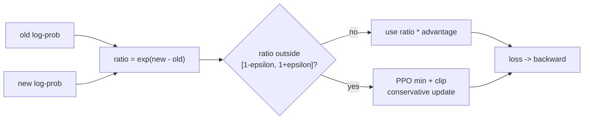

# P07 PPO 如何 clip？为什么取 min？CISPO 又改了哪里？

<div class="lesson-meta" data-lesson-id="p07">
  <span>M4 · Project 7 / 35</span>
  <strong>对齐与 RL 基础</strong>
  <button type="button" class="lesson-complete">标记为已完成</button>
</div>

## 7.1 先看不 clip 的一次灾难性更新

旧策略在某个 token 上给概率 $0.01$，新策略因为一个高分样本把它提到 $0.20$。概率比是 $20$。如果这个动作的 advantage 为 $+5$，它在 surrogate 中的贡献是 $20\times5=100$；同批其他几十个普通样本可能只贡献不到 $1$。一次偶然的 verifier 高分就能把策略推向这个动作，接着生成重复、冗长或 reward-hacking 的回答。

PPO 的核心问题不是“怎样让 reward 变大”，而是“怎样在复用旧 rollout 时限制一次更新不要离行为策略太远”。



## 7.2 从 on-policy 梯度到 importance ratio

理想情况下，样本来自当前策略 $\pi_\theta$。但为了省生成成本，PPO 用旧策略 $\mu$ 先生成，再训练当前策略。对一个动作样本，重要性比为

$$
r_t(\theta)
=\frac{\pi_\theta(a_t\mid s_t)}
{\mu(a_t\mid s_t)}.
$$

每个量的含义：

- 分子是当前模型给这个**已经采到的动作**的新概率；
- 分母是 rollout 时行为策略给它的旧概率；
- $r_t=1$ 表示当前策略在这个动作上没有改变；
- $r_t>1$ 表示提高了该动作概率；
- $r_t<1$ 表示降低了该动作概率。

用 advantage 加权，未裁剪的 surrogate（最大化形式）是

$$
L^{\mathrm{PG}}(\theta)
=\mathbb E_t[r_t(\theta)A_t].
$$

如果 $A_t>0$，增大 $r_t$ 会提高目标；如果 $A_t<0$，减小 $r_t$ 会提高目标。这正是策略梯度想做的事，但没有任何远离旧分布的刹车。

## 7.3 PPO-Clip 的分段公式

对称 clip 版本写成

$$
L^{\mathrm{clip}}_t
=\min\left(
r_tA_t,
\operatorname{clip}(r_t,1-\epsilon,1+\epsilon)A_t
\right).
$$

其中

$$
\operatorname{clip}(r,1-\epsilon,1+\epsilon)
=\min\left(\max(r,1-\epsilon),1+\epsilon\right).
$$

逐项读：先把 ratio 限在区间 $[1-\epsilon,1+\epsilon]$，再与未裁剪项比较，取对优化更保守的那个。

把 $\epsilon=0.2$ 代入，可以得到四种情况：

| advantage | ratio | 未裁剪项 | clip 后在最大化中的效果 |
|---:|---:|---:|---|
| $A>0$ | $r<1.2$ | 随 $r$ 增大 | 正常鼓励提高好动作 |
| $A>0$ | $r>1.2$ | 继续增大 | 取 $1.2A$，不再奖励继续提高 |
| $A<0$ | $r>0.8$ | $rA$ 随 $r$ 增大而变得不那么负 | 正常鼓励降低坏动作 |
| $A<0$ | $r<0.8$ | 继续降低会更负 | 取 $0.8A$，不再奖励继续降低 |

为什么是 `min`？PPO 想最大化一个“悲观估计”：如果某次更新看起来比允许范围更激进，就使用较小的收益估计。若你在代码中最小化 loss，通常写成 $-L^{\mathrm{clip}}$，所以实现里的 `min`、`max` 视觉方向可能与论文目标相反，必须先确认优化器是在最小化还是最大化。

## 7.4 一个四个 token 的数值例子

设四个 token 的 $(A,r)$ 为

$$
(1,1.5),\quad (-1,0.5),\quad (2,1.1),\quad (-2,0.9),
$$

且 $\epsilon=0.2$。逐项计算：

- 第一项：未裁剪为 $1.5$，裁剪为 $1.2$，取 $1.2$；
- 第二项：未裁剪为 $-0.5$，裁剪为 $-0.8$，取较小的 $-0.8$；
- 第三项：未裁剪为 $2.2$，裁剪为 $2.2$，取 $2.2$；
- 第四项：ratio 在区间内，未裁剪和裁剪项都是 $-1.8$。

这里第二项看似违反直觉：坏动作已经降得很多，$rA=-0.5$ 比 $-0.8$ 大，所以 `min` 选择 $-0.8$，不让目标通过“过度降低”获得额外乐观收益。PPO 的 surrogate 是保守下界式设计，不是把每个 ratio 简单截断后再平均。

## 7.5 不 clip 会怎样

一次更新中，梯度近似为

$$
\nabla_\theta L^{\mathrm{PG}}
=\mathbb E_t\left[r_tA_t
\nabla_\theta\log\pi_\theta(a_t\mid s_t)\right].
$$

当 $r_t$ 很大时，梯度也会被同比放大。典型故障链是：

1. 少数高 advantage 样本产生巨大 ratio；
2. policy KL 快速增大，旧 rollout 变得 stale；
3. 采样分布进入 verifier 没覆盖的区域；
4. reward model 被表面模式骗过，熵塌缩或长度爆炸；
5. 下一批 reward 方差更大，训练出现 NaN 或完全失去多样性。

clip 不是严格的 trust region。它只约束**采样到的动作 ratio**，未采样 token 的概率仍可能移动；所以还要看 approximate KL、entropy、ratio 分位数和 clip fraction。

## 7.6 Asymmetric clip 与多 epoch

如果提高好动作比降低坏动作更危险，可使用上下界不同的形式：

$$
L_t
=\min\left(
r_tA_t,
\operatorname{clip}(r_t,1-\epsilon_l,1+\epsilon_h)A_t
\right).
$$

一批 rollout 复用多个 PPO epoch 时，$\mu$、$A_t$ 和 reward 应冻结；每个 epoch 只重算当前策略的 log-prob。若重新计算 old log-prob 或 advantage，优化的已不是同一个 surrogate。

## 7.7 CISPO：裁剪权重，但保留 log-prob 梯度

CISPO 的关键改动是先把 ratio 裁剪，再停止这条裁剪权重的梯度：

$$
L_{\mathrm{CISPO}}
=-\mathbb E_t\left[
\operatorname{sg}\left(
\operatorname{clip}(r_t,1-\epsilon_l,1+\epsilon_h)
\right)A_t\log\pi_\theta(a_t\mid s_t)
\right].
$$

这里 `sg` 表示 stop-gradient：

- ratio 的数值仍限制在区间内，避免极端权重；
- 但即使 ratio 超界，$\log\pi_\theta$ 这条路径仍然有梯度；
- PPO surrogate 在某些超界 token 上会变成常数，梯度直接为零，CISPO 不做这个“完全关掉”。

CISPO 仍然是截断 importance sampling，有偏；旧样本太陈旧、support 不覆盖或 verifier 漂移时，它不会恢复无偏性。不同论文 recipe 还可能使用单边上界、response mean 或动态采样，不能只凭方法名猜默认区间。

## 7.8 PPO 与 CISPO 的最小对照代码

```python
ratio = (new_logp - old_logp).exp()

# 最大化 surrogate；训练框架通常最小化负号。
plain = ratio * advantage
clipped_ratio = ratio.clamp(1.0 - eps_low, 1.0 + eps_high)
ppo_surrogate = torch.minimum(plain, clipped_ratio * advantage)
ppo_loss = -(ppo_surrogate * mask).sum() / mask.sum().clamp_min(1)

# CISPO: weight 被截断且 detach，但 logp 仍在计算图中。
weight = clipped_ratio.detach()
cispo_loss = -(weight * advantage.detach() * new_logp * mask).sum()
cispo_loss /= mask.sum().clamp_min(1)
```

建议在 toy logits 上打印每个 token 的 `ratio`、`ppo_surrogate`、`cispo_weight` 和梯度；不要只用最终 reward 判断两者是否实现正确。

## 7.9 项目实验与完成标准

做一个四动作 bandit：行为策略均匀，奖励向量为 $(1,0,0,-1)$。故意把 learning rate 调大，分别使用无 clip PPO、PPO-Clip 和 CISPO。每种设置跑相同随机种子，记录：

- ratio 的 p50/p99；
- clip fraction；
- approximate KL；
- entropy；
- 每个动作概率的轨迹；
- 单样本梯度范数。

完成标准：你能画出一个超界正 advantage 和超界负 advantage 的梯度曲线，并说明为什么 PPO 用 `min`，以及 CISPO 的 `detach` 改变了哪条梯度路径。

## 7.10 可以继续追问什么

- PPO clip 为什么不是严格的 KL trust region？
- ratio 是 token-level 还是 sequence-level 时，clip fraction 的解释是否一样？
- 什么时候应该 early stop 一个 PPO epoch，而不是继续 clip？
- detached clipped weight 是否会造成什么新的偏差？
- stale rollout、reward hacking 和 ratio 爆炸如何用日志区分？

---

本章由仓库根目录的 `llm_rl_35_questions_project_course.md` 自动拆分。需要修订正文时，请修改源稿后运行 `./scripts/split_course.ps1`，不要只编辑本页。
