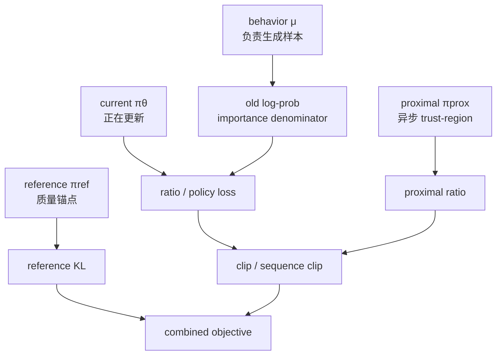

# P08 GRPO 为什么加 KL？为什么 DAPO、Dr.GRPO、GSPO 可能去掉？

<div class="lesson-meta" data-lesson-id="p08">
  <span>M4 · Project 8 / 35</span>
  <strong>对齐与 RL 基础</strong>
  <button type="button" class="lesson-complete">标记为已完成</button>
</div>

## 8.0 先看两个相反的故障

实验 A 中任务 reward 从 $0.4$ 升到 $0.8$，但 reference KL 和回答长度同时暴涨，模型开始重复模板；实验 B 中 KL 几乎为零，模型却从未采到低概率的正确长解。前一个说明缺少约束会失控，后一个说明约束太强会压住探索。本章的目标是用同一张目标函数解释这两个方向，并明确什么时候“去 KL”只是换一种 trust-region 责任。

## 8.1 先区分三个“旧模型”

在一段 RL 代码里经常同时出现三个模型：

1. **行为策略** $\mu$：真正生成这批回答的 snapshot；它出现在 PPO/GRPO 的 importance denominator；
2. **当前策略** $\pi_\theta$：正在更新的模型；
3. **参考策略** $\pi_{\mathrm{ref}}$：通常冻结，用于质量锚定和 KL 正则。

把 $\mu$ 错写成 $\pi_{\mathrm{ref}}$，或者把“旧策略 ratio”误叫“KL penalty”，会让公式和实现都错位。先写清楚锚点，再讨论是否去 KL。



## 8.2 为什么要有 reference KL

只最大化 verifier reward 时，模型可能钻漏洞、复制短期模板，甚至遗忘原来会的语言能力。一个常见目标是

$$
J(\pi)
=\mathbb E_{y\sim\pi}[r(x,y)]
-\beta\,\mathrm{KL}
\left(\pi(\cdot\mid x)\Vert
\pi_{\mathrm{ref}}(\cdot\mid x)\right).
$$

第一项鼓励任务奖励，第二项惩罚离参考模型太远，$\beta$ 控制两者交换。若训练框架最小化负的 policy objective，代码中通常会出现 `+ beta * kl_loss`；符号不要脱离“正在最小化还是最大化”来背。

## 8.3 从拉格朗日函数推导最优策略

对固定提示词，令 $p_y=\pi(y\mid x)$、$p^r_y=\pi_{\mathrm{ref}}(y\mid x)$。在约束 $\sum_y p_y=1$ 下，目标为

$$
\sum_y p_y r_y
-\beta\sum_y p_y\log\frac{p_y}{p^r_y}.
$$

加入乘子 $\lambda$，对 $p_y$ 求导：

$$
r_y-\beta\left(\log\frac{p_y}{p^r_y}+1\right)+\lambda=0.
$$

把与 $y$ 无关的量收进归一化常数，得到

$$
p_y
\propto p^r_y\exp(r_y/\beta).
$$

这说明 KL 正则不是随便加的惩罚：它把参考分布按 reward 的指数重新加权。$\beta$ 小时高 reward 样本被强烈放大，$\beta$ 大时更接近 reference。

## 8.4 token-level KL 怎样估计

若动作来自当前策略 $a\sim\pi_\theta(\cdot\mid s)$，单个采样 token 的 log-ratio 是

$$
k_1=\log\pi_\theta(a\mid s)-\log\pi_{\mathrm{ref}}(a\mid s).
$$

对当前策略取期望：

$$
\mathbb E_{a\sim\pi_\theta}[k_1]
=\mathrm{KL}(\pi_\theta\Vert\pi_{\mathrm{ref}}).
$$

但是单个 $k_1$ 可以为负，因为某个被采样 token 可能在 reference 下概率更大。常见的逐样本非负估计器令

$$
u=\frac{\pi_{\mathrm{ref}}(a\mid s)}
{\pi_\theta(a\mid s)},
$$

再取

$$
k_3=u-\log u-1.
$$

函数 $z-\log z-1$ 对 $z>0$ 非负，并且在当前策略采样时

$$
\mathbb E_{a\sim\pi_\theta}[k_3]
=\mathrm{KL}(\pi_\theta\Vert\pi_{\mathrm{ref}}).
$$

常见的 $k_2=\tfrac12(\log u)^2$ 在接近时是二阶近似，但不是同一个无偏估计。三者的方向、采样策略和 response mask 必须一起写。

## 8.5 数值例子：为什么单 token KL 会是负数

当前策略给两个 token 的概率 $(0.8,0.2)$，reference 给 $(0.5,0.5)$。若采到第一个 token：

$$
k_1=\log(0.8/0.5)\approx0.470.
$$

若采到第二个 token：

$$
k_1=\log(0.2/0.5)\approx-0.916.
$$

第二种单样本值为负，但期望是

$$
0.8\times0.470+0.2\times(-0.916)
\approx0.193,
$$

正好等于 $\mathrm{KL}(\pi_\theta\Vert\pi_{\mathrm{ref}})$。不要看到负的 token KL 就断言实现错误；要看 batch 平均和估计器定义。

## 8.6 “估计 KL 数值”不等于“得到 KL 梯度”

把采样 token 当作常量，直接把 $k_3$ 放入 autograd loss，只会沿着当前 log-prob 的显式路径求导。真正的

$$
D(\theta)=\mathrm{KL}(\pi_\theta\Vert\pi_{\mathrm{ref}})
$$

还包含采样分布 $\pi_\theta$ 随 $\theta$ 变化的项。使用 score-function 写梯度（固定状态 $s$）可得

$$
\nabla_\theta D
=\mathbb E_{a\sim\pi_\theta}
\left[
\left(\log\pi_\theta(a\mid s)
-\log\pi_{\mathrm{ref}}(a\mid s)
\right)
\nabla_\theta\log\pi_\theta(a\mid s)
\right].
$$

其中额外的常数 $+1$ 乘以 score 后期望为零。工程上常把 log-ratio 作为 detached reward 乘以 policy-gradient；如果在固定 prefix 上能访问完整词表，也可以直接算 conditional KL。不能因为一个标量估计器数值无偏，就自动认为它的直接反向传播也无偏。

## 8.7 为什么 DAPO、Dr.GRPO、GSPO 可能去掉 KL

去掉显式 KL 的理由是目标和系统条件改变了，而不是 KL 永远无用：

- verifier 很可靠、任务是数学/代码等可验证推理时，强 reference 约束可能压制低概率但正确的长路径；
- reference 模型需要额外显存和前向，长回答成本尤其高；
- 训练已用 ratio clip、sequence-level divergence、entropy 和版本控制承担部分 trust-region 责任；
- 某些 recipe 发现 KL 项的噪声或尺度让优化更难调。

但去 KL 后要主动补上监控：当前/reference 的 log-ratio 分布、任务外能力、熵、长度、重复率和 verifier 红队结果。否则 reward hacking 可能更快发生。

## 8.8 这些方法各自去掉了什么，不要混写

| 方法 | 主要改变 | 与 KL 的关系 |
|---|---|---|
| GRPO | group-relative advantage，常配 token ratio | 可以加显式 reference KL，但不是 ratio 本身 |
| DAPO | decoupled clipping、dynamic sampling、token-level 聚合、overlong shaping | 公开 recipe 去掉显式 KL；其他实现可能保留小项 |
| Dr.GRPO | 分析并移除特定的长度与 group-std 归一偏差 | $\beta=0$ 的实验不等于所有实现必须无 KL |
| GSPO | 长度归一的 sequence ratio 与 sequence-level clipping | 重点改 ratio 噪声，是否加 reference KL 需看具体 recipe |

方法名不能代替代码审计：至少检查 `old_logp`、`ref_logp`、KL estimator、mask、aggregation 和 loss sign。

## 8.9 KL 项的伪代码

若 prefix 被当作固定训练输入，并且能访问完整词表，可以直接计算 conditional KL。这条路径对 conditional KL 的梯度是完整的：

```python
policy_logp_all = policy.logits(batch.prefixes).log_softmax(dim=-1)
with torch.no_grad():
    ref_logp_all = reference.logits(batch.prefixes).log_softmax(dim=-1)

policy_prob_all = policy_logp_all.exp()
conditional_kl = (
    policy_prob_all * (policy_logp_all - ref_logp_all)
).sum(dim=-1)
kl_loss = (conditional_kl * batch.response_mask).sum()
kl_loss /= batch.response_mask.sum().clamp_min(1)
```

若只能使用采样 token，则可把 sampled log-ratio 停止梯度后当作负 reward，走 policy-gradient 路径：

```python
new_logp = policy.token_logp(batch.answers)
old_logp = batch.behavior_logp.detach()
ref_logp = reference.token_logp(batch.answers).detach()

ratio = (new_logp - old_logp).exp()
sampled_log_ratio = (new_logp - ref_logp).detach()
regularized_advantage = (
    batch.task_advantage.detach() - beta * sampled_log_ratio
)
policy_term = clipped_surrogate(ratio, regularized_advantage)
loss = -masked_token_mean(policy_term, batch.response_mask)
```

这段 sampled 写法仍需行为策略的 importance correction；若回答来自旧行为策略，直接平均 sampled log-ratio 不是当前策略分布下的 KL 数值。完整词表版本只给固定 prefix 的 conditional KL；若要得到完整 sequence KL，当前策略诱导的 prefix 分布也必须纳入。

## 8.10 项目实验与完成标准

在一个 verifier 可靠的小任务上固定 group、学习率和 rollout，比较 $\beta\in\{0,10^{-3},10^{-2},10^{-1}\}$。记录：

- 任务成功率；
- token-level 与 sequence-level log-ratio；
- entropy 和长度分位数；
- reference 模型上的通用语言评测；
- reward 与独立 verifier 的相关性。

完成标准：你能解释某次训练中“KL 数值变小但 KL 梯度实现仍可能不对”的原因，并能说明去 KL 后哪一个额外约束或监控负责防止策略失控。

## 8.11 可以继续追问什么

- reverse KL 与 forward KL 在 reference support 很小时各自会发生什么？
- token-level KL 的 batch 平均如何受到长度和 EOS mask 影响？
- sequence-level ratio 与 reference KL 是否能互相替代？
- 何时应该使用完整词表 conditional KL，而不是 sampled-token estimator？
- 去掉 KL 后，如何用 divergence budget、early stop 或红队测试建立新的 trust region？

---

本章由仓库根目录的 `llm_rl_35_questions_project_course.md` 自动拆分。需要修订正文时，请修改源稿后运行 `./scripts/split_course.ps1`，不要只编辑本页。
