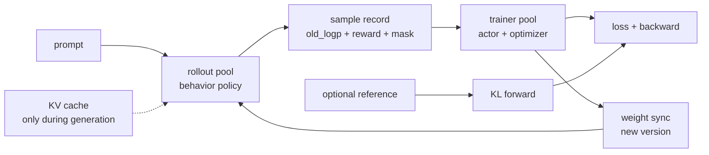

# P20 GRPO 显存账本项目：模型到底有几份？

  M6 · Project 20 / 35
  <strong>训练与推理系统</strong>
  <button type="button" class="lesson-complete">标记为已完成</button>

## 20.0 先区分“逻辑模型”和“物理副本”

GRPO 通常没有 PPO 的 critic，但一次训练仍可能涉及三种**逻辑角色**：

| 角色 | 是否必需 | 它做什么 |
|---|---|---|
| current/actor | 必需 | 用当前参数重算 log-prob、算 loss、反向传播 |
| behavior/rollout | 生成这批回答时必需 | 采样回答并记录 `old_logp`；生成结束后可以只保留记录 |
| reference | 只有使用 reference-KL 时必需 | 提供一个冻结的安全锚点 |

“有三个角色”不等于“训练卡上永远放三份完整模型”。如果 rollout 在独立 GPU 池，behavior 的物理副本在那边；如果把 `old_logp` 写入样本，trainer 不需要为了它再留一份 old model。reference 是否与 actor 同卡，也由拓扑决定。先画出 GPU 池和时间段，再数显存，不能把不同阶段的表格直接相加。

## 20.1 参数级账本

参数数为 $P$，权重/梯度/master/Adam 状态字节数为 $b_w,b_g,b_m,b_{m1},b_{m2}$：

$$
M_{\mathrm{actor}}
=P(b_w+b_g+b_m+b_{m1}+b_{m2})
+M_{\mathrm{activation}}+M_{\mathrm{workspace}}+M_{\mathrm{comm}}.
$$

BF16 权重和梯度各 2 bytes，FP32 master、$m$、$v$ 各 4 bytes 时是 16 bytes/param；是否有独立 master、是否 8-bit optimizer 要查实现。7B 的一份 BF16 frozen 权重约 $7\times10^9\times2\approx14$ GB；全参训练参数状态约 112 GB，还没算 activation。

## 20.2 KV 与分片

$$
M_{\mathrm{KV}}\approx2LBT H_{kv}d b.
$$

它随活跃序列和长度增长；训练 activation 不是 serving KV。FSDP/ZeRO 理想上把参数状态按 data-parallel shard 分摊，但 all-gather 峰值、padding 和通信 buffer 仍存在。

## 20.3 项目账本：先画拓扑，再填数字

对每个 GPU 和每个阶段记录参数、梯度、optimizer、activation、KV、通信 buffer 和 `stage`。至少比较两种拓扑：

1. **独立 GPU 池：** rollout 卡负责生成，trainer 卡负责 log-prob/backward；两张卡的显存峰值分别计算。
2. **colocate/复用：** 同一张卡在不同时间装载不同角色；只有确实重叠的对象才相加，权重切换和 all-gather 的瞬时峰值单独记录。

分别模拟去掉 reference、使用 8-bit optimizer、8-way shard 和减半 generation length，重算每个池的峰值。这样得到的是可解释的账本，而不是把所有模型大小无条件相加。

## 20.4 手算一个 7B 拓扑

用十进制 GB 做数量级估算。7B actor 的一份 BF16 frozen 权重约 $7\times10^9\times2\approx14$ GB；若全参训练把权重、梯度、master、Adam 状态按 16 bytes/param 估算，参数状态总量约 112 GB。下面的数字只用于说明口径，真实值要以 profiler 为准。

**拓扑 A：独立 rollout 池（不把两张卡的显存相加）**

| GPU 池/阶段 | 主要驻留对象 | 粗略量级 |
|---|---|---:|
| rollout 池，generation | 一份 BF16 behavior 权重 + KV | $14\text{ GB}+M_{KV}$ |
| trainer 池，log-prob | 8-way shard 的 actor 权重（约 $14/8=1.75$ GB/卡）+ 可选 reference | 另加约 14 GB（若 reference 未分片） |
| trainer 池，backward | 8-way shard 的 actor 参数状态 + activation/workspace | 约 $112/8=14$ GB/卡 + 临时量 |

**拓扑 B：同卡 colocate/时间复用**

如果同一张卡先生成、再卸载 behavior、再做 trainer forward，理想情况下峰值接近各阶段峰值的最大值，而不是 $14+14+112$ GB；如果 rollout 与 backward 真正并发，就必须把同时驻留的对象相加。去掉 reference 最多能省掉它实际驻留的权重和临时 activation（例如一份未分片 7B BF16 权重约 14 GB），不会省掉 actor 的 optimizer state。

每个 GPU/阶段保存 `allocated_bytes`、`reserved_bytes`、`peak_bytes`、`param_bytes`、`grad_bytes`、`optimizer_bytes`、`activation_bytes`、`kv_bytes`、`allgather_bytes`、`model_version` 和 `stage`。不要只保存 `nvidia-smi` 的单一数字。

**验收标准**：账本预测峰值与 profiler 相差不超过预先设定的 10%～20%；去 reference 后只减少其驻留权重/forward，不把 actor optimizer 误算成节省；分片和 colocate topology 写在图上。 
**追问**：为什么 old policy 不一定是第二个模型？CPU offload 省了哪类字节、又引入什么带宽瓶颈？训练 activation 与 serving KV 为什么不能相加后称为“模型显存”？

---

本章由仓库根目录的 `llm_rl_35_questions_project_course.md` 自动拆分。需要修订正文时，请修改源稿后运行 `./scripts/split_course.ps1`，不要只编辑本页。
