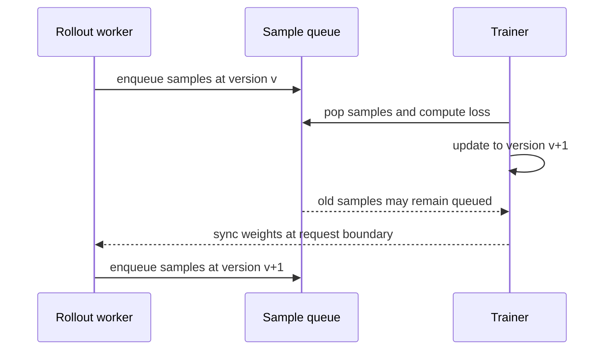

# P27 把同步 RL 改造成异步流水线

<div class="lesson-meta" data-lesson-id="p27">
  <span>M6 · Project 27 / 35</span>
  <strong>训练与推理系统</strong>
  <button type="button" class="lesson-complete">标记为已完成</button>
</div>



## 27.0 先看同步的浪费

四个 rollout 请求耗时分别为 1、1、2、8 秒。同步 batch 必须等 8 秒；如果训练再用 3 秒、发布权重用 1 秒，一轮至少是

$$
T_{sync}=8+3+1=12\ \text{s}.
$$

异步时，短请求可以先进入 trainer。在**没有 group 必须收齐、minibatch/watermark、prefill/queue 和同步边界等额外 barrier**，且 reward 生成后立即可用的理想 steady-state 流水线里，耗时下界才接近 $\max(8,3)+1=9$ 秒；真实系统还要把这些等待逐项计时。本项目要同时测 throughput 和 freshness。

## 27.1 三种“异步”不是一回事

1. **同版本 continuous batching：** 请求动态加入/退出，但 update 仍使用一个快照；主要是调度优化。
2. **pipeline async：** rollout 与 trainer 交错，样本可跨一两个版本；需要保存 version。
3. **fully async actor--learner：** rollout 持续生产，learner 按队列取样，允许显著 stale；需要 off-policy 控制。

读论文或仓库时先问：“样本生成后，参数更新几次仍可进入 loss？”这个问题比 `async` 标签更可靠。

## 27.2 队列为何会失控

设 rollout 生产率为 $\lambda_r$、trainer 消费率为 $\lambda_t$，两者单位都用“有效 token-work/s”（可以把一次 token 的生成、verifier 或训练成本换算成统一 token-work），队列中的未消费工作量为 $Q(t)$：

$$
\frac{dQ}{dt}\approx\lambda_r-\lambda_t.
$$

当 $\lambda_r>\lambda_t$，队列持续增长；样本版本 lag、显存占用和等待时间一起增长。当 $\lambda_r<\lambda_t$，trainer 经常空等。稳定点要求两者接近，并设置最大 token-work 队列深度 $Q_{max}$ 做 backpressure。若实现只维护“样本条数”队列，就必须同时记录每条样本长度和服务时间；重尾长度下，单纯比较 sample/s 会误判稳定性。

## 27.3 stale 的三个量

最容易记录的是版本差

$$
\Delta v=v_{learner}-v_{sample}.
$$

但真正影响梯度的是策略分布差。对同一个 token，可记录 ratio

$$
\rho_t=\exp\left(\log\pi_{learner}(a_t\mid s_t)
-\log\mu_{sample}(a_t\mid s_t)\right).
$$

还可以记录样本在 queue 等待的 wall-clock age，以及 token-level KL。学习率大时两步更新可能比学习率小时十步更新更远，因此不能只说“lag 小于 4 就安全”。

## 27.4 最小实验

实现三个版本：

```text
A. barrier synchronous
B. queue asynchronous, no filter
C. queue asynchronous + Qmax + ratio/KL filter
```

每 10 秒记录：有效 token/s、queue depth、trainer idle fraction、`delta_version` p50/p95、ratio p99、clip fraction、reward、丢弃率和 weight-sync latency。预期 B 吞吐高但 stale 失控；C 应在吞吐和新鲜度之间折中。

一个仅用于观察趋势的降权函数是

$$
w_i=\operatorname{clip}\left(e^{-\alpha\Delta v_i},w_{min},1\right).
$$

它不是普适的无偏修正；严谨校正要使用实际 behavior log-prob，并检查 support 是否被 top-$p$ 截断。

## 27.5 失败现象与修复

- 队列深度锯齿：设置 high/low water mark，避免生产者和消费者反复启停。
- reward 降低但 GPU 更忙：检查是否把被过滤的 stale token 也算进吞吐。
- 不同 verifier 分数混在一起：记录 verifier version 和规则配置。
- 同一 group 跨版本凑样本：按 policy snapshot 和 prompt id 分组，或使用明确的跨版本 estimator。

**验收：** 你能从一张时间线指出同步的 `max` 等待在哪里，给出队列稳定条件，并解释为什么版本 lag 不是唯一的 stale 指标。

---

本章由仓库根目录的 `llm_rl_35_questions_project_course.md` 自动拆分。需要修订正文时，请修改源稿后运行 `./scripts/split_course.ps1`，不要只编辑本页。
