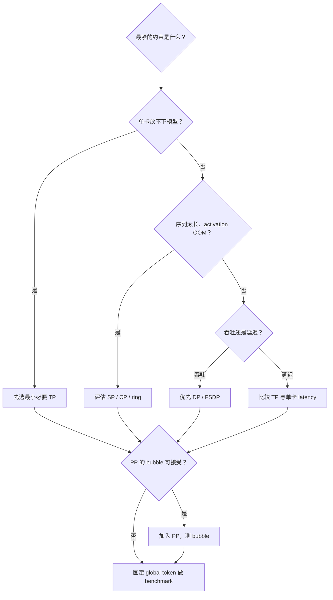

# P30 长上下文的 compute--communication overlap 与并行选择

<div class="lesson-meta" data-lesson-id="p30">
  <span>M6 · Project 30 / 35</span>
  <strong>训练与推理系统</strong>
  <button type="button" class="lesson-complete">标记为已完成</button>
</div>

## 30.0 先看一个时间线

当上下文从 8k 增到 128k，attention 计算、activation 和 KV 会变大；通信是否变大，取决于你用的是 FSDP 参数 collective、DP 梯度 collective，还是 CP/sequence-dependent collective。若一层计算 20 ms、参数 all-gather 15 ms，完全串行要 35 ms；若通信能被前 15 ms 的计算隐藏，理想时间接近 20 ms。真正要测的是 trace 上是否有重叠，而不是配置文件里是否出现 `overlap` 字样。

## 30.1 为什么长上下文放大问题

对训练或一次性 prefill，attention 的 token 两两交互使每层计算量近似随序列长度平方增长：

$$
\text{FLOPs}_{attn}\propto T^2d,
$$

而**未做 sequence/context sharding 的单份**激活和 KV 大致随 $T$ 线性增长。$T$ 变成 4 倍时，这部分 activation/KV 可能变成约 4 倍，attention 计算可能变成约 16 倍；FSDP 的参数/梯度分片大小和每层 all-gather 字节主要由参数量、shard 和 wrap 粒度决定，通常不会自动因为 $T$ 变 4 倍就变 4 倍。更长的计算有时反而更容易隐藏这类固定通信；但 CP 的序列相关通信、micro-batch 因显存压力变小、重算或 critical path 改变，都可能让通信重新暴露。因此要按具体并行路径和 trace 判断，不能只从序列长度倍数猜通信量。

自回归 decode 要单独看：每次只为一个新 token 读取长度约 $T$ 的历史，单步 attention 更接近 $O(Td)$；生成 $T$ 个 token 的总工作量才可能累积到二次量级。不要把训练/prefill 的 $T^2$ 直接套到 decode 的单步延迟。

## 30.2 Megatron 的并行维度

- **TP：** 切分层内矩阵或 attention head；依赖频繁 all-reduce/all-gather，适合节点内高速互联。
- **PP：** 按层切分，activation 在阶段间发送；micro-batch 太少会有 bubble。
- **DP：** 每卡不同样本，反向同步梯度；主要扩吞吐。
- **SP：** 在 TP 下切 sequence，降低单卡 activation。
- **CP：** 把长序列分给不同卡，attention 用 ring 或 all-gather 访问远端 token。
- **EP：** 分片 MoE expert，通信路径见 Project 29。



一个简单的选择例子：若模型**只能**放在 8 卡单节点而单卡放不下，TP 是自然起点；若模型本来能放进单卡且目标是吞吐，单卡或 DP 可能比 TP 少通信。跨 4 节点且 context 极长时，增加 CP 可能比继续扩大 TP 更自然；层数很多且可以接受 pipeline bubble，再加 PP。实际组合必须用 global batch、序列长度和 checkpoint 设置公平比较。

## 30.3 FSDP 做什么、不做什么

FSDP 把参数、梯度和 optimizer state 分片，但完整参数何时驻留取决于 strategy。`FULL_SHARD` / `reshard_after_forward=True` 通常是：forward 前 all-gather，forward 后 reshard；backward 前再次 all-gather，backward 后 reduce-scatter 梯度并 reshard。`SHARD_GRAD_OP` / `reshard_after_forward=False` 可以在 forward 到 backward 之间保留完整参数，少一次 gather，但峰值 HBM 更高。FSDP2 和具体 release 的命名略有差异，必须按 strategy 和 trace 核对。FSDP 不是 context parallel，也不会自动把一个 128k 序列拆到多卡；长上下文仍需 FlashAttention、activation checkpoint 或额外 CP/Ulysses/ring 方案。

## 30.4 overlap 的一个最小推导

设计算时间为 $C$，通信时间为 $M$，真正重叠的时间为 $O$。理想的单层时间账本是

$$
T_{layer}=C+M-O,
\qquad 0\le O\le\min(C,M).
$$

若 $C=20$ ms、$M=15$ ms、$O=15$ ms，理想 $T=20$ ms；若只有 $O=7.5$ ms 通信与计算重叠，则 $T=27.5$ ms。若想使用隐藏比例，可定义 $h=O/M$，此时还必须满足 $hM\le C$。这个公式只是时间账本，$O$ 或 $h$ 必须从 profiler 测量。

## 30.5 最小实验：两种并行路线

对同一模型、同一 global token 数、同一 precision 和 checkpoint 设置，比较：

```text
Route A: FSDP + activation checkpoint
Route B: Megatron TP/PP（必要时 CP）+ communication overlap
```

用 Nsight/NCCL trace 标记 forward、all-gather、reduce-scatter、attention、activation recompute。输出：有效 token/s、峰值 HBM、通信占比、bubble 比例、p95 step time。不要只比较“每秒 step”，因为两条路线可能有不同 padding 或重算量。

## 30.6 常见失败

- 打开 `tp-comm-overlap` 但 trace 没有重叠：检查 backend、bucket size、stream 依赖和 micro-batch。
- prefetch 让速度变快却 OOM：重叠以更多同时驻留参数/activation 为代价。
- CP 的 ring 通信跨节点拥塞：重新规划 process group 和拓扑，或减少跨节点 CP。
- FSDP all-gather 很碎：调整 wrap 粒度和 bucket，避免每个小模块都触发通信。

**验收：** 你能用 $T=C+M-O$ 解释一个 trace，说明 TP/PP/DP/CP/FSDP 各自切了什么，并提出一个公平 benchmark 的控制变量表。

---

本章由仓库根目录的 `llm_rl_35_questions_project_course.md` 自动拆分。需要修订正文时，请修改源稿后运行 `./scripts/split_course.ps1`，不要只编辑本页。
