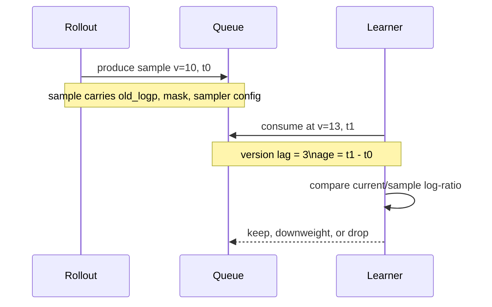

# P33 full async 的 staleness 到底有多大

<div class="lesson-meta" data-lesson-id="p33">
  <span>M6 · Project 33 / 35</span>
  <strong>训练与推理系统</strong>
  <button type="button" class="lesson-complete">标记为已完成</button>
</div>

## 33.0 先看一个错误回答

面试中有人问“staleness 多少步可接受”，回答“通常 4 步”。这不严谨：若每步学习率很小，10 步的分布变化可能比高学习率下 2 步还小；若 queue 中样本等待了 30 秒，版本差相同但数据年龄完全不同。本项目要把“旧”拆成三个可测量的量。

## 33.1 三种 stale 定义

**版本 lag：**

$$
\Delta v=v_{learner}-v_{sample}.
$$

简单、便宜，但只告诉你更新次数。

**时间 age：**

$$
age=t_{consume}-t_{produce}.
$$

它反映 queue、网络和 verifier 等待；同一个 $\Delta v$ 可能对应完全不同的 age。跨 worker/跨机器计算时，两个时间戳必须来自协调器的统一单调时钟或经过校准的时间服务；不能直接相减不同主机各自的 `time.monotonic()`。

**分布 drift：** 对样本中实际执行的动作，记录

$$
\rho_t=\exp\left(\log\pi_{current}(a_t\mid s_t)
-\log\mu_{sample}(a_t\mid s_t)\right).
$$

也可以用采样 token 上的近似 KL：

$$
\widehat{KL}
=\frac{1}{N}\sum_{i,t}m_{i,t}
\left(\log\mu_{sample}(a_{i,t}\mid s_{i,t})
-\log\pi_{current}(a_{i,t}\mid s_{i,t})\right).
$$

这里 $N=\sum_{i,t}m_{i,t}$，即这一批 response 的有效 token 总数。若误用 padded sequence length，短 response 会被 padding 稀释，batch 组成一变，监控值也会跟着变。



这不是完整分布 KL，而是对已采样动作的估计；它适合做在线监控，但要明确估计方式。

## 33.2 为什么要看分位数

平均 lag 可能是 1.2 步，但 p99 样本在队列里等了 20 步。对每个 update 记录 mean、p50、p95、p99 的 `delta_version`、age、ratio 和 KL；再按 lag 分桶绘制 reward、gradient norm、clip fraction。若只有 p99 崩坏，可以设置淘汰阈值，而不必降低所有 worker 的吞吐。

一个实用的过滤逻辑是“版本或分布任一超限即丢弃/降权”：

```python
# log_ratio、mask 的形状都是 [batch, response_len]
# 用 log-ratio 的绝对值同时看“变大”和“变小”两侧
log_ratio = current_logp - sample_logp
abs_log_ratio = log_ratio.abs().masked_fill(~mask.bool(), float("nan"))
log_ratio_p99_per_sample = torch.nanquantile(abs_log_ratio, 0.99, dim=1)
# sampled log-ratio 的均值可能为负；这里直接监控绝对 drift。
drift_per_sample = (log_ratio.abs() * mask).sum(dim=1) / mask.sum(dim=1).clamp_min(1)

keep = (delta_version <= max_lag)  # shape: [batch]
keep &= (log_ratio_p99_per_sample <= max_abs_log_ratio_p99)
keep &= (drift_per_sample <= max_drift)
keep &= (mask.sum(dim=1) > 0)
```

这里必须沿 token 维度为**每条样本**计算 p99 和 drift。若直接写 `ratio.quantile(0.99)`，得到的是整个 batch 的一个标量，再广播给所有样本，结果只会“全收”或“全丢”；只看 `ratio` 的上侧还会漏掉 ratio 很小的 token。若有完整词表 KL，应优先用那个非负量；上面用 sampled log-ratio 的绝对值只是便宜的在线 gate。阈值应通过小规模扫描选出；上面的代码不是理论保证。

## 33.3 AReaL 等 recipe 如何表达上限

一些 fully async 实现用最大 staleness 参数 $\eta$ 做 backpressure：$\eta=0$ 接近同步，增大 $\eta$ 提高重叠但允许更 stale。公开论文/代码中的示例值随任务和版本变化（例如 code/math 配置可见 4 或 8 的上限），不能把它当作行业常数。报告实验时要写清楚：GPU 数、batch、learning rate、generation length、过滤规则和 $\eta$。

## 33.4 重要概念区分

- $\pi_{old}$ 或 $\mu_{sample}$：importance correction 的分母；
- $\pi_{ref}$：质量先验或 KL reference；
- $\pi_{prox}$：异步 proximal trust-region 的锚点。

把 stale behavior 的 log-prob 当成 reference KL，会把“样本来自旧策略”误诊成“模型偏离质量先验”。

## 33.5 最小实验与解释

让两个 rollout worker 以不同速度生产，learner 每次更新后记录当前 version。分别设置 `max_lag=0,2,4,8,unbounded`，保持所有其他超参不变。输出：

```text
accepted/dropped samples, queue depth
lag and age quantiles, ratio p99, KL
reward mean/std, gradient norm, clip fraction
```

画出“有效 token/s--reward--p99 lag”三条曲线。若 unbounded 的吞吐最高却 reward 不稳定，说明 off-policy 误差已超过异步收益；若 `max_lag=0` 仍有 drift，检查 sampling warper 和 rollout/trainer kernel 不一致。

**验收：** 你能回答“没有通用可接受步数”的原因，并能用 ratio/KL/age 解释一个具体 update 是否过 stale。

---

本章由仓库根目录的 `llm_rl_35_questions_project_course.md` 自动拆分。需要修订正文时，请修改源稿后运行 `./scripts/split_course.ps1`，不要只编辑本页。
