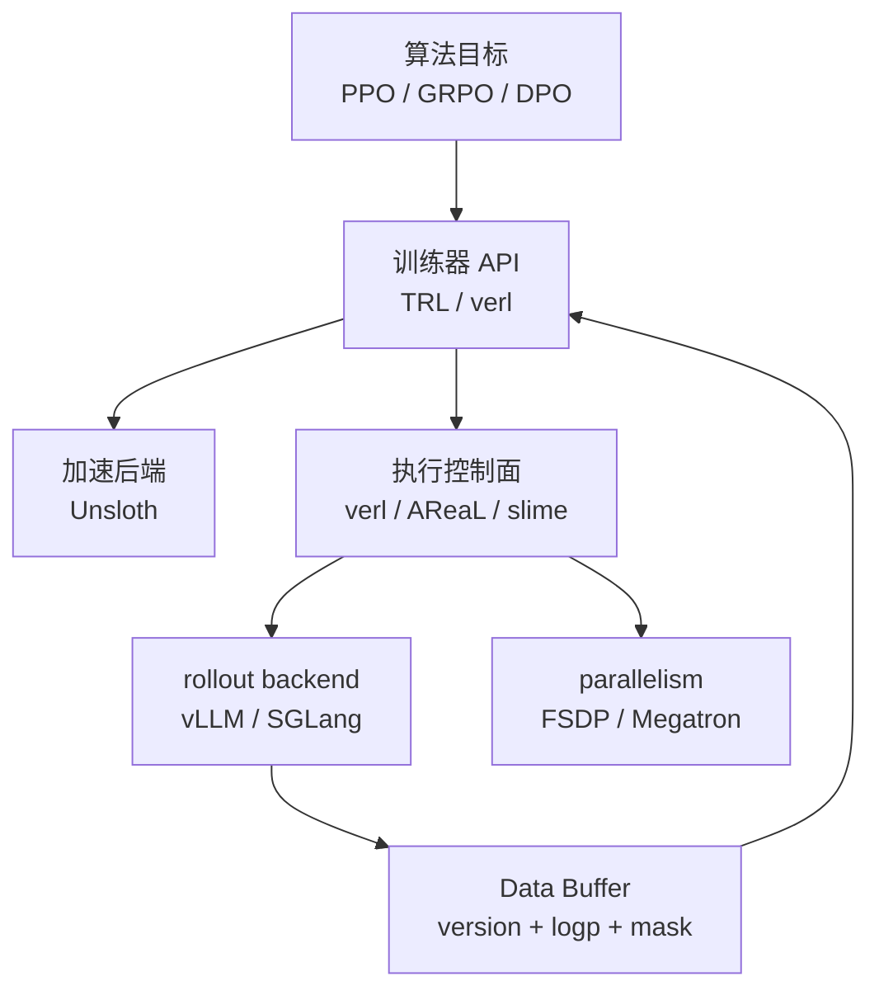

# P35 VeRL、TRL、Unsloth、AReaL、slime 的选择实验

<div class="lesson-meta" data-lesson-id="p35">
  <span>M6 · Project 35 / 35</span>
  <strong>训练与推理系统</strong>
  <button type="button" class="lesson-complete">标记为已完成</button>
</div>

## 35.0 先看一个现实约束

如果只是想验证 reward，直接搭一个 fully async、Megatron、SGLang、MoE 集群会把主要时间花在通信和版本适配上；如果已经有数百张卡和长 CoT rollout，单机脚本又会成为瓶颈。选择框架应从“我要证明什么、手头有什么硬件”开始，而不是从项目热度开始。

## 35.1 先分层，再比较路线

| 组件 | 所在层级 | 适合的第一项目 | 优点 | 主要代价 |
|---|---|---|---|---|
| TRL | 算法/训练器库 | HF 模型上快速验证 DPO/GRPO；PPO 需走 experimental 接口 | API 简单、资料多、改 loss 快 | 复杂 actor--learner 和大规模 rollout 要自己补 |
| Unsloth | 模型与 kernel 加速后端，可与 TRL 配合 | 单机/少机、LoRA、显存紧张的原型 | 显存和 kernel 优化友好，上手快 | 它本身不是完整的异步 RL 控制面 |
| verl/HybridFlow | 分布式 RL 编排与执行系统 | 从研究扩到通用分布式 RL | 可接 FSDP/Megatron、vLLM/SGLang、agent | 配置和调试成本中高 |
| AReaL | 异步 actor--learner 系统 | 长 CoT、rollout 长尾、异步 actor--learner | v2 把训练、推理、agent、权重更新解耦为服务 | 队列、off-policy 和复现门槛高 |
| slime | Megatron + SGLang RL 基础设施 | 已维护 Megatron + SGLang，需深度定制 | MoE/长上下文/agent 数据流和底层性能可控 | 组件耦合、版本适配和维护成本高 |

这五项并不全是同一层的替代品：TRL 可以调用 Unsloth 加速后的模型，二者还可再置于更大的执行系统中。表格的用途是先确定你缺的是“算法 API”“省显存/快 kernel”，还是“跨进程 actor--learner 控制面”。slime 能跑同步，verl 的当前主分支也有 experimental fully-async 路径；所有能力都要按稳定度和锁定 commit 核验。

TRL 的 PPO 接口在部分当前版本位于 `trl/experimental/ppo`，实验性 API 可能随 release 改名或改契约；把“支持 PPO”写进项目报告时，应同时锁定 TRL 版本/commit，并先跑本课程的 golden batch。DPO/GRPO 与 PPO 的成熟度也不要用同一句“TRL 支持”一概而论。



## 35.2 四步选择法

**第一步：写最小目标。** 例如“在 1 台 8 卡机器上证明 verifier reward 能提升数学 pass@1”，而不是含糊地说“做 RL”。

**第二步：跑 golden batch。** 固定 prompt、response、old log-prob、reward 和 mask，比较 Python 参考实现与框架 loss/gradient。框架能启动不代表 ratio、mask、global token reduction 正确。

**第三步：profile 真瓶颈。** 如果 70% 时间在 rollout 长尾，研究 async；如果 70% 在 trainer all-gather，先改 parallelism；如果 reward 本身噪声大，换框架不会解决问题。

**第四步：再扩大规模。** 先用 TRL 验证算法，显存或 kernel 成为瓶颈时可同时接入 Unsloth；需要多机编排时再比较 verl、AReaL 与 slime。`fully async` 不是“必须迁移到某一个框架”的充分条件：verl 也有实验性路径，真正的选择依据是当前 commit 的稳定度、staleness 契约、可观测性和团队已有栈。

## 35.3 一个可执行的评分表

给每个候选框架按 1--5 分评分，权重由项目目标决定：

| 维度 | 例子 |
|---|---|
| 算法可改性 | 能否替换 advantage、reducer、KL 和 verifier |
| rollout 能力 | continuous batching、工具调用、partial rollout、old log-prob |
| 并行规模 | FSDP/TP/PP/EP、跨节点通信和 weight sync |
| 可观测性 | ratio/KL/version/queue/KV 指标是否可导出 |
| 复现与维护 | golden batch、版本锁定、故障回放、团队已有经验 |

不要把“tokens/s”单独作为评分项；它必须和 reward、有效 token 定义及 stale 丢弃率一起看。

## 35.4 最小迁移项目

使用同一个 500 条 prompt 数据集，在小模型上依次实现：

```text
Stage A: TRL trainer + 可选 Unsloth backend，同步、单机
Stage B: verl，多 GPU，固定 rollout backend
Stage C: 只有 profile 证明必要时，再试 AReaL 或 slime
```

每个阶段都保存同一套 artifact：checkpoint、tokenizer、sampling config、reward 组件版本、golden-batch 输出、吞吐/延迟/显存报告。若迁移后 reward 变化，先回放 golden batch，再比较真实 rollout 的 policy version 和 log-prob；不要直接归因于“框架算法不同”。

## 35.5 最终验收与面试追问

你应该能回答：

1. 为什么小模型算法验证优先选择简单路线？因为先降低 reward/mask/estimator 的变量数量。
2. 什么时候选择 AReaL？当 rollout 长尾和同步 barrier 已被 profile 证明是主瓶颈，并且团队愿意承担 stale 调试。
3. 什么时候选择 slime？已有 Megatron/SGLang 运维能力，且需要 MoE、长上下文或 agent 级数据流控制。
4. 为什么“框架能跑”不等于“训练正确”？因为 reduction、behavior log-prob、mask、权重版本和 sampler support 仍可能不一致。

**课程总验收：** 从第 25 章的 GPU/KV 指标，到第 35 章的框架决策，你能给一条样本画出完整生命周期；能在单卡 golden batch 上验证 loss，再逐步加入 DP/TP/EP、异步队列和权重同步；每次优化都能回答“有效 token/s、reward、staleness、显存和复现性分别发生了什么变化”。

---

本章由仓库根目录的 `llm_rl_35_questions_project_course.md` 自动拆分。需要修订正文时，请修改源稿后运行 `./scripts/split_course.ps1`，不要只编辑本页。
