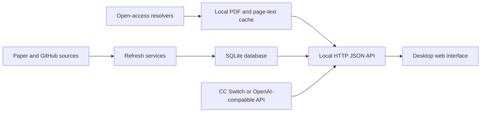
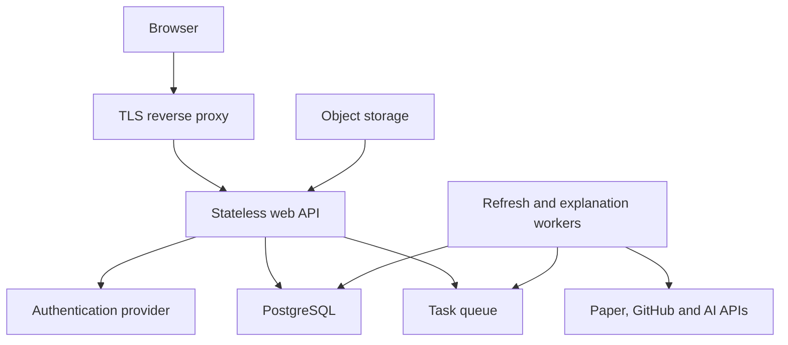

# Paperfield Architecture

## Current deployment model

Paperfield is a single-process application. The beta sharing mode adds a small password-protected account gateway, but beta accounts still share one isolated beta workspace:



This model is appropriate for a personal workstation and short private beta sessions through a temporary tunnel. It is not a permanent multi-user service: account-specific reading state still requires the schema migration described below.

## Existing boundaries

- `config.json`: collection policy and topic queries.
- `venues.json`: publication-domain knowledge.
- `institutions.json`: representative institution aliases and research strengths used for informational badges.
- `PaperStore`: persistence boundary.
- `PaperSources` and `GitHubSource`: external-source adapters.
- `PaperExplainer`: AI-provider adapter.
- `PaperAssetService`: open-access resolution, PDF cache, page extraction, and cached reading notes.
- `PaperConnector`: DOI, title, Crossref, and arXiv lookup for user-requested imports.
- `S3ObjectStorage`: optional private cloud archive behind an S3-compatible API.
- `ProjectAssetService`: bounded, text-only GitHub repository cache and source reader.
- `ProjectExplainer`: README/source-grounded project explanation and chat.
- `TranslationService`: non-GPT browser/LibreTranslate/Google translation path.
- `AppHandler`: HTTP boundary.
- `static/`: browser client.

The largest current constraint is that these boundaries still live in one `app.py` file. They are behavioral boundaries, not yet Python package boundaries.

## Target multi-user architecture



## Required migration phases

### Phase 1: modularize without changing behavior

Split `app.py` into:

```text
paperfield/
├─ settings.py
├─ domain/
├─ repositories/
├─ sources/
├─ services/
└─ web/
```

Keep the current API and SQLite behavior stable while moving code.

### Phase 2: introduce schema migrations

Add a migration tool before changing user-owned data. The first multi-user schema should separate shared research metadata from user state:

```text
users
workspaces
workspace_members
papers
github_projects
paper_project_links
user_paper_state
saved_searches
explanations
```

`user_paper_state` should use `(user_id, paper_id)` as its key. Explanations may be private per user or shared by prompt/model version.

### Phase 3: authentication

Use an established OpenID Connect provider rather than implementing passwords directly. The API should derive the user from a verified session, never from a caller-supplied user ID header.

### Phase 4: PostgreSQL and workers

- Replace SQLite with PostgreSQL for concurrent writes and multiple instances.
- Move scheduled refreshes and long AI explanations into background workers.
- Ensure only one scheduler owns each refresh job.
- Store secrets in the deployment platform secret manager.

## Compatibility rules

- Keep `/api/health` unauthenticated and free of private information.
- Version public APIs before introducing breaking changes.
- Preserve source metadata separately from generated explanations.
- Store downloaded PDFs in private object storage for cloud deployment; never make publisher files public by default.
- Never place authentication secrets or provider keys in browser JavaScript.
- Add an explicit database migration for every persistent schema change.
